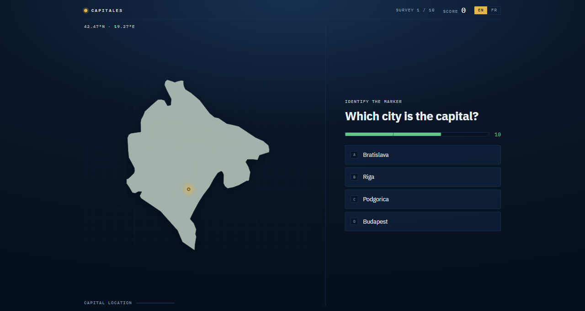
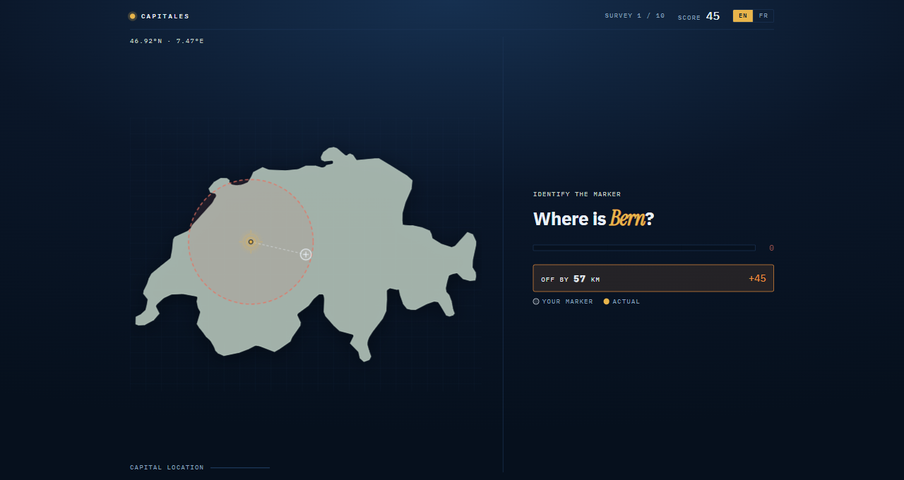

# Capitales

A capital-cities quiz with two ways to play, in English and French.

**Name** — the marker is on the capital; say which city it is.

**Place** — the city is named; put the marker where you think it is. Points fall
off with distance, measured against the size of what is on screen, so being
57 km out in Switzerland is not scored like 57 km out in Canada.

193 countries, drawn offline from Natural Earth data in an azimuthal
equal-area projection. 15 seconds a question, streak multipliers, and a separate
leaderboard per mode.

Remake of a Visual Basic game from ~1996.

## Download

Ready-built for Windows, Linux, Android and the browser:
[**Releases**](https://github.com/iago-swi/capitales-claude/releases/latest).

The browser one is a single HTML file — download it, double-click it, done. It
works offline, with no install and no server.

## Requirements

Node 24+ and npm 11+. Nothing else — the database is SQLite via Node's
built-in `node:sqlite`, so there is no server to install and no Java.

## Running in the browser

Once, to load the country data:

    npm run seed

Then two terminals:

    npm run server     # API on http://127.0.0.1:8787
    npm run dev        # app on http://localhost:5173

## One file, no install

    npm run build:single     # -> apps/single/dist/index.html

A single 830 KB HTML file. Double-click it and it opens in whatever browser you
already have — Windows, Linux, macOS, phone. Scores are kept in that browser's
localStorage. Small enough to email.

## Desktop builds

    npm run dev:desktop      # build and run the desktop app
    npm run package:win      # Windows: installer + portable exe
    npm run package:linux    # Linux: tarball
    npm run package:android  # Android: APK (needs the Android SDK + a JDK 21)

Artifacts land in `apps/desktop/release`:

| File | Notes |
|---|---|
| `Capitales-<version>-setup.exe` | Windows installer |
| `Capitales-<version>-portable.exe` | Windows, no installation — just run it |
| `Capitales-<version>-x64.tar.gz` | Linux — extract and run `./capitales` |

`apps/android/release/Capitales-<version>.apk` (4.3 MB) is the Android build,
and `apps/single/dist/index.html` (830 KB) the no-install option, 120× smaller
than the desktop installers.

AppImage and `.deb` are configured but need a Linux machine, WSL or Docker;
see `PROJECT.md` section 14.

The desktop builds host the API inside the Electron process, seed themselves on
first launch, and store their database in `%APPDATA%\Capitales` on Windows or
`~/.config/Capitales` on Linux.

## Testing

    npm run verify     # typecheck, tests, and both builds — the real gate
    npm test           # 240 tests, nothing to start first
    npm run typecheck

`verify` builds as well as testing on purpose: `tsc` does not read the
`<script>` block of a `.svelte` file, and `svelte-check` refuses TypeScript 7,
so the bundler is the only thing that type-checks the components. `PROJECT.md`
section 1 has the three bugs that gap has cost.

## Documentation

- `PROJECT.md` — everything worth knowing, in English
- `PROJET.md` — la même chose, en français
- `docs/superpowers/` — the original design spec and implementation plan
